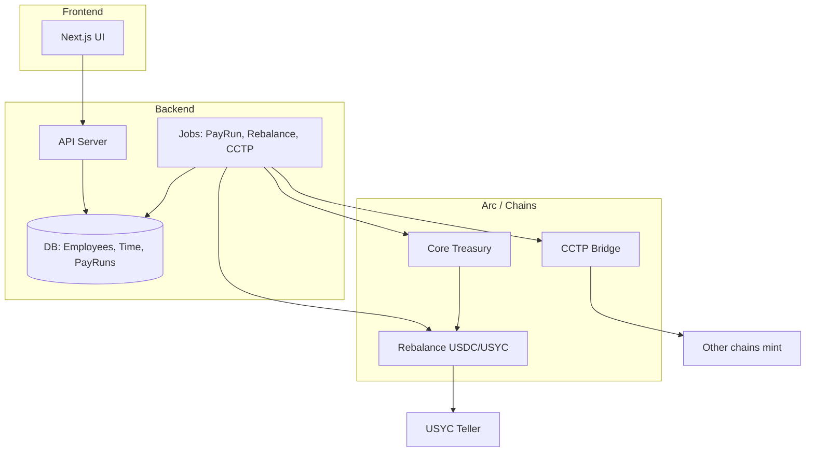

# Backend and Contracts Plan

## Context and existing code

- **Frontend plan** (see [dayforce_payroll_frontend_6e201304.plan.md](file:///Users/nk/.cursor/plans/dayforce_payroll_frontend_6e201304.plan.md)): Dayforce-style UI, pay runs, recipients, treasury, employee earnings (pro-rated, available to withdraw = earned − paid), time tracking (check-in/out or schedule-based), automatic capital → USYC / USYC → USDC when needed.
- **Existing contracts** ([contracts/src/](contracts/src/)):
  - **Core.sol** – Treasury holding USDC (Arc address), owner withdraw, allocate to Vesting, cancel vest.
  - **Rebalance.sol** – USDC ↔ USYC via Teller; whitelisted EOA (CEO) only for deposit/redeem.
  - **Vesting.sol** – Linear USDC vesting: createVest, withdrawVest, cancelVest.
- **Frontend** currently uses Sepolia USDC/USYC/Teller ([frontend/src/lib/contracts.ts](frontend/src/lib/contracts.ts)); contracts reference Arc USDC (`0x3600...`). Unify deployment target (Arc testnet vs Sepolia) as part of this work.
- **No backend** exists yet; all employee/pay-run/recipient data is mock.
- **Arc**: CCTP + Bridge Kit for cross-chain USDC; Arc as hub. Arc testnet: USDC, USYC, Teller, TokenMessenger/MessageTransmitter for CCTP. See [Arc docs](https://docs.arc.network/arc/tutorials/bridge-usdc-to-arc) and [contract addresses](https://docs.arc.network/arc/references/contract-addresses).

---

## 1. Contracts

### 1.1 Treasury and rebalancing (extend existing)

- **Core (or new PayrollTreasury):**
  - Keep single owner (or migrate to role-based: admin/payroll role).
  - Hold USDC on Arc; optionally support receiving USDC bridged from other chains (CCTP mint at Arc).
  - **Batch payout:** `executePayRun(recipients[], amounts[], chainIds[]?)` or per-chain batch: pull USDC from treasury and transfer to each recipient (on Arc). If multi-chain payouts are on-chain, integrate with CCTP/bridge to send to destination chain (see 1.3).
  - Integrate with **Rebalance**: before a pay run, backend (or a keeper) calls redeem USYC → USDC if treasury USDC is insufficient; Core could call a “ensure liquidity” function that uses Rebalance.
- **Rebalance:**
  - Keep USDC ↔ USYC (Teller) with whitelisted EOA or extend to a **treasury/contract address** so that an automated backend/keeper can call `usdcToUsyc` / `usycToUsdc` (e.g. treasury contract as whitelisted, or Rebalance owned by Core and only Core can trigger).
  - Add **automatic rebalance policy** on-chain (optional): e.g. “if USDC > X and no pending pay run, allow keeper to call usdcToUsyc” and “if pay run needs Y USDC, allow keeper to call usycToUsdc(Y)”. Alternatively, keep rebalance logic entirely in the backend and use existing whitelisted EOA for signing txs.

### 1.2 Pay runs and recipients (Option A – on-chain pay run record)

- **On-chain pay run record (chosen):**
  - New contract **PayRun** (or extend Core): store pay run id, period (e.g. periodStart, periodEnd or payday timestamp), total amount, status (pending / executed / failed), and list of (recipient address, amount, chainId). Owner/admin submits the pay run (creates on-chain record with recipients, amounts, chainIds).
- **Execution (on-chain):** When the pay run is executed, the contract (or Core) transfers USDC from the treasury to each recipient on Arc; for recipients on other chains, backend/CCTP handles cross-chain sends (see 1.3). On-chain status is updated to executed (and optionally per-recipient status / tx hashes emitted).
  - **Recipients:** On-chain only addresses (and amount, chainId per item); employee metadata stays in backend. Backend syncs "already paid out" from on-chain pay run history (sum of executed pay run items per employee).
  - **Contract API:** e.g. `createPayRun(bytes32 payRunId, uint256 periodEnd, address[] calldata recipients, uint256[] calldata amounts, uint256[] calldata chainIds)` stores the pay run in pending state; `executePayRun(bytes32 payRunId)` validates, pulls USDC from Core, transfers to each recipient on Arc, and marks executed. Cross-chain items are handled by backend (Bridge Kit) after same-chain transfers; backend can call a method to mark pay run as fully executed or record off-chain payout tx hashes.
### 1.3 Multi-chain (Arc as hub)

- **Arc as hub:** Company holds USDC on Arc (Core). For payroll:
  - **Same-chain (Arc):** Core transfers USDC to recipient wallets on Arc.
  - **Other chains:** Use **CCTP** (Bridge Kit) to send USDC from Arc to destination chain (burn on Arc, mint on target). Backend orchestrates: (1) ensure USDC liquidity on Arc (redeem USYC if needed), (2) call CCTP burn/mint flow via Circle Bridge Kit with recipient address on target chain.
- **Contracts:** Core (or a thin “BridgeHelper”) only needs to hold and transfer USDC on Arc. Cross-chain logic lives in **backend** (Bridge Kit SDK, Circle APIs). Optionally, a **Keeper/Relayer** contract that backend triggers to initiate CCTP burn with recipient/target chain; attestation and mint are handled by Circle/Arc infra.
- **Recipient model:** Each recipient has a **primary wallet** and optionally **chain preference**. Backend decides: payout on Arc only, or bridge to recipient’s preferred chain via CCTP.

### 1.4 Vesting and payroll relationship

- **Vesting** remains for linear release (e.g. token grants). **Payroll** is separate: recurring pay based on pro-rated earnings (yearly/daily/hourly), paid from Core.
- **Available to withdraw (employee):** Not a separate contract; it’s **earned − paid** computed in backend. When employee “withdraws,” backend includes them in the next pay run (or triggers an on-demand payout from Core). No need for a separate “withdraw” contract unless you want employees to claim on-chain; then you could add a **Claims** contract: backend signs “employee X can claim amount Y”; employee submits signature and receives USDC from Core.

### 1.5 Policy-based / condition-based payouts

- **Off-chain (recommended for v1):** Backend evaluates policies (e.g. “pay when date = payday,” “pay when balance > threshold”). When conditions pass, backend creates pay run and executes via Core.
- **On-chain (optional):** Simple conditions in a contract, e.g. “release payroll when block.timestamp >= paydayTimestamp” or “when oracle reports X.” Contract calls Core to execute a predefined pay run. More complex rules (schedule, holidays) are easier in backend.

---

## 2. Backend

### 2.1 Role and scope

- **API server** (Node/TS recommended; fits Bridge Kit and existing frontend): REST or tRPC for frontend; internal jobs for payroll, rebalance, cross-chain.
- **Responsibilities:** Employee/recipient CRUD, time tracking (check-in/out, schedule, holidays), pro-rated earnings calculation, “already paid out” and “available to withdraw,” pay run creation and execution (calling contracts + Bridge Kit), automatic USDC/USYC rebalance, optional policy engine.

### 2.2 Data model (backend)

- **Company:** id, name, settings (time_tracking_mode: check_in_out | schedule_based, pay_frequency, etc.).
- **Employee / Recipient:** id, wallet_address, name, pay_type (yearly | daily | hourly), rate (in smallest unit, e.g. cents), chain_preference (optional), company_id, schedule_id (optional).
- **Schedule:** id, employee_id, working_days (e.g. [1,2,3,4,5]), hours_per_day, timezone.
- **Holidays:** id, company_id or global, date.
- **Time entries:** id, employee_id, date, clock_in, clock_out (for check_in_out mode).
- **Pay run:** id, company_id, period_start, period_end, status (draft | approved | executed | failed), total_amount, executed_at, tx_hash(es).
- **Pay run items:** id, pay_run_id, employee_id, amount, chain_id (for multi-chain), status, tx_hash.
- **Cumulative paid:** employee_id, total_paid (updated when pay run executes); or derive from sum of pay_run_items where status = executed.

Pro-rated earnings (current period / YTD): computed from time entries or schedule + holidays, using pay_type and rate. Available to withdraw = earned_to_date − total_paid.

### 2.3 API surface (high level)

- **Auth:** Wallet-based (SIWE or similar); map wallet to employee or admin. Return role (admin vs employee) so frontend can show the correct nav. Admin/CEO can manage recipients and pay runs; employees can read own earnings and time.
- **Dashboard:** GET summary for frontend widgets: total treasury (USDC/USYC on Arc), pending pay run (if any), last executed pay run, optional alerts. Implement as GET /dashboard or compose from GET /treasury/balances, GET /pay-runs?status=pending, GET /pay-runs?status=executed&limit=1.
- **Recipients:** CRUD (admin); list as payroll recipients with wallet_address, name, pay_type, rate, chain_preference, schedule. Expose consistently for frontend Recipients table and pay run builder.
- **Employees (self):** GET my profile, pay type, rate, schedule.
- **Time:** POST check-in / check-out (if enabled); GET my time entries; GET schedule and holidays (read-only for employees). Admin: set schedule, set holidays.
- **Earnings:** GET my earnings: pro-rated current period, YTD, already paid, available to withdraw; pay type, rate, optional breakdown. Matches frontend MyEarningsPage.
- **Pay runs:** Admin: list (each with id, period_start, period_end, status, total_amount, recipient_count; when executed include tx_hash for explorer); create (draft), approve, POST execute (backend runs createPayRun, ensure liquidity, executePayRun, sync). GET pay run detail and items. Pay run **id** is backend DB id; frontend uses it for /pay-runs/[id].
- **Treasury:** GET balances (USDC/USYC on Arc; optionally per-chain). Admin: trigger manual rebalance or configure auto policy. Frontend Treasury page and Auto capital status use this.
- **Policies:** Admin: list/create/edit policy rules. Frontend Policies page uses this when integrated.

### 2.4 Jobs and automation

- **Pay run execution:** When admin triggers "execute" (or policy triggers it): (1) Backend creates the on-chain pay run first (createPayRun) with recipients, amounts, chainIds. (2) Compute required USDC; **ensure liquidity:** if Core USDC < required, call Rebalance.usycToUsdc(shortfall). (3) Call PayRun.executePayRun(payRunId): contract transfers USDC to each Arc recipient and updates on-chain status. (4) For recipients on other chains, backend uses Bridge Kit to send USDC from Arc to target chain and records tx hashes; optionally mark pay run fully executed. (5) Backend syncs pay run and pay_run_items from chain; updates cumulative paid per employee from on-chain executed pay run data.
- **Auto rebalance (idle → USYC):** Periodic job (e.g. daily): if Core USDC > threshold and no pending pay run in next N hours, call Rebalance.usdcToUsyc(amount). Requires backend to hold whitelisted EOA keys or treasury contract to be whitelisted.
- **Auto rebalance (USYC → USDC for payroll):** Triggered by “execute pay run” when USDC is insufficient (see above).
- **Cross-chain (CCTP):** Use Circle Bridge Kit in backend: initiate burn on Arc with destination chain and recipient; poll attestation; complete mint on destination. Store destination wallet per recipient (and chain preference) in DB.

### 2.5 Integration with Arc / Circle

- **Bridge Kit:** Install `@circle-fin/bridge-kit` (and adapter for dev-controlled wallets if needed). Backend uses it to: bridge USDC from another chain to Arc (e.g. company funds Arc treasury), and bridge USDC from Arc to recipient chain for payroll.
- **Wallet/keys:** For automated txs (rebalance, pay run execution), use a **secure signer** (env-backed EOA or HSM). For CCTP, Circle Entity Secret + API key (see [Arc bridge tutorial](https://docs.arc.network/arc/tutorials/bridge-usdc-to-arc)) if using dev-controlled wallets; or company EOA with sufficient gas on Arc and source/destination chains.
- **RPC:** Arc testnet (and any other chains for CCTP). Contract addresses from [Arc references](https://docs.arc.network/arc/references/contract-addresses) (Arc testnet USDC, Teller, CCTP).

---

## 3. Implementation order (suggested)

1. **Contracts**
   - Add **PayRun** contract (or extend Core): createPayRun(payRunId, periodEnd, recipients[], amounts[], chainIds[]) in pending state; executePayRun(payRunId) to transfer USDC from Core to each recipient on Arc and set status to executed. Core must expose transfer-from-treasury to PayRun (or PayRun holds USDC and Core funds it). Emit events for pay run created and executed.
   - Add **batchPayout** (or equivalent) used internally by PayRun when executing; wire Core to Rebalance for ensure-liquidity if needed.
   - Extend Rebalance so that either treasury contract or keeper EOA can call usdcToUsyc / usycToUsdc; document who holds keys.
2. **Backend scaffold**
  - Repo: `backend/` (Node + TypeScript), DB (e.g. SQLite/Postgres), env for RPC, private key, Circle API key/entity secret if using Bridge Kit.
  - Tables: company, employee, schedule, holidays, time_entries, pay_run, pay_run_items, cumulative_paid (or derived).
3. **Auth and employees**
  - SIWE (or wallet sign-in); map address to employee or admin. CRUD employees/recipients, pay type, rate, chain preference, schedule, holidays.
4. **Time tracking**
  - Check-in/out API and storage; schedule-based “expected hours” computation; pro-rated earnings (yearly/daily/hourly) and available to withdraw.
5. **Pay runs**
  - Create draft (backend); create on-chain pay run (createPayRun). Approve, then execute: ensure liquidity (USYC→USDC), call PayRun.executePayRun(payRunId). Backend syncs status and "already paid out" from on-chain pay run data.
6. **Auto rebalance**
  - Job: if USDC > threshold and no imminent pay run, call usdcToUsyc. Use env-held EOA or treasury contract.
7. **Multi-chain (CCTP)**
  - Integrate Bridge Kit; add “destination chain + address” to recipient; on execute pay run, for each cross-chain recipient call Bridge Kit to send USDC from Arc to their chain.
8. **Policies**
  - Store policy rules (e.g. cron + condition); job that creates and optionally executes pay runs when conditions hold.
9. **Frontend**
9. **Frontend integration**
  - Replace mock data with API calls; connect Execute pay run and My earnings / My time to backend. See **Frontend-backend integration plan** (frontend_backend_integration_plan.md) for env, auth, API client, and pay run flow.
---

## 4. Diagram (backend + contracts)

---

## 5. Out of scope / later

- Full RWA backing (USYC is already yield-bearing; no additional RWA contracts in scope).
- On-chain policy engine (complex rules); keep policies in backend for v1.
- Employee self-service “claim” contract (optional; can add Claims contract later if needed).
- Production key management and HSM (document requirement; implement in deployment phase).
- Circle Gateway (chain-abstracted balance) as alternative to CCTP; can be evaluated later for “one liquidity surface” UX.

---

This plan ties together contracts (Core, Rebalance, PayRun, batch payouts), backend (employees, time, pro-rated earnings, pay runs, rebalance and CCTP jobs), and Arc as hub for USDC and cross-chain payroll, aligned with the frontend plan. Once both frontend and backend are built, use the **Frontend-backend integration plan** to connect them.