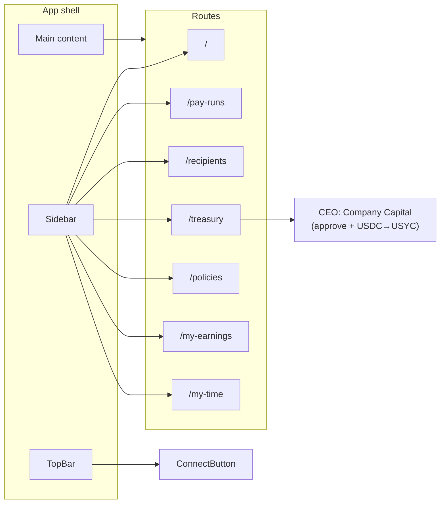

# Dayforce-Style Payroll Frontend Plan

## Current state

- **Stack:** Next.js 15 (App Router), React 19, wagmi + RainbowKit + viem, TanStack Query. No UI library; inline styles only. Single route `/` with CEO-only “Company Capital” (USDC → USYC convert).
- **Relevant files:** [frontend/src/app/page.tsx](frontend/src/app/page.tsx), [frontend/src/app/layout.tsx](frontend/src/app/layout.tsx), [frontend/src/app/globals.css](frontend/src/app/globals.css), [frontend/src/lib/contracts.ts](frontend/src/lib/contracts.ts).

## Target UX (Dayforce-inspired)

- **Layout:** Left sidebar (nav) + top bar (logo, global actions, ConnectButton). Main content area with clear hierarchy.
- **Dashboard:** Widget-style cards (total treasury, pending pay run, last pay date, issues/variance-style summary). Click-through to detail views.
- **Pay Runs:** List of pay runs (period, status, total amount, recipient count). “New pay run” CTA. Preview/drill-down (mock).
- **Recipients:** Table of payees (name/identifier, wallet, amount, chain/preference). Add/edit (mock).
- **Employee experience:** Employees have access to **pro-rated earnings** for time worked. Time can be tracked in two ways (company-configurable): (1) **Check-in / check-out** – employees clock in and out; or (2) **Schedule-based** – automatic tracking from the employee’s schedule (working days, holidays). Pay can be **yearly salary**, **daily salary**, or **hourly salary**; earnings are pro-rated accordingly. **Available to withdraw** = pro-rated earnings to date **minus** amounts already paid out (from past pay runs); previously paid amounts are not included in the withdrawable balance.
- **Treasury:** Multi-chain USDC view (e.g. Sepolia, Base, Arbitrum as one “liquidity surface”), Arc as hub. Existing CEO “Company Capital” (approve + convert USDC → USYC) lives here. **Automatic capital distribution (goal):** unused company capital is automatically moved to USYC for yield; when USDC is required for a function (e.g. payroll run, bill pay), the system aims to automatically redeem USYC back to USDC as needed.
- **Policies (optional):** Placeholder for “policy-based or condition-based payouts” (e.g. rules list or “coming soon”).
- **Cross-chain messaging:** UI copy and badges that say “Powered by Arc” and “Multi-chain USDC – one liquidity surface”; optional chain filter or “All chains” toggle so the app feels chain-abstracted.

All payroll/recipient/treasury data can be **mock** for this phase (no backend/contracts yet).

---

## 1. Design system and layout

- **Visual style:** Enterprise payroll look: clean, high information density, neutral palette (grays, one primary for actions), subtle borders, card-based sections. Avoid “crypto” look; aim for Dayforce/ADP/Gusto admin feel.
- **Typography:** Keep Geist in [layout.tsx](frontend/src/app/layout.tsx). Use a clear type scale (e.g. 12–14px for secondary, 16–18px for section titles, 24–28px for page titles).
- **Layout structure:**
  - **Sidebar (left, ~220–240px):** Logo at top, nav links (Dashboard, Pay Runs, Recipients, Treasury, Policies). Employee links: **My earnings**, **My time**. Role-based visibility: show admin vs employee nav based on wallet/role (mock). Optional footer (e.g. “Arc” badge). Collapsible on small screens if desired.
  - **Top bar:** App title, breadcrumb or page title, right side: chain indicator (e.g. “All chains” or current chain), ConnectButton.
  - **Main:** Padding, max-width optional; scrollable content.
- **Recommendation:** Introduce **Tailwind CSS** for speed and consistency (sidebar, cards, tables, spacing). Alternatively keep plain CSS/globals + a small set of reusable components with consistent class names.

---

## 2. Route structure (App Router)

| Route            | Purpose                                                                             |
| ---------------- | ----------------------------------------------------------------------------------- |
| `/`              | Dashboard (widgets, KPIs)                                                           |
| `/pay-runs`      | Pay runs list + “New pay run” (mock)                                                |
| `/pay-runs/[id]` | Pay run detail / preview (mock)                                                     |
| `/recipients`    | Recipients table + add (mock)                                                       |
| `/treasury`      | Multi-chain USDC + Arc hub; embed existing CEO Company Capital flow here            |
| `/policies`      | Placeholder for condition-based payouts (optional)                                  |
| `/my-earnings`   | Employee: pro-rated earnings (current period, YTD); pay type and rate               |
| `/my-time`       | Employee: check-in/out (if enabled) or schedule/hours view (working days, holidays) |

Use a shared layout under `app/(dashboard)/layout.tsx` that renders Sidebar + TopBar and wraps `children`, so only these routes get the payroll shell. Root `layout.tsx` stays minimal (font, Providers, globals).

---

## 3. Components to build

- **Layout**
  - `Sidebar` – nav links (Dashboard, Pay Runs, Recipients, Treasury, Policies; employee: My earnings, My time), logo, Arc badge. Role-based visibility for admin vs employee sections.
  - `TopBar` – page context, chain indicator, ConnectButton.
  - `DashboardLayout` – client component that wraps sidebar + top bar + main area; used in `(dashboard)/layout.tsx`.
- **Dashboard**
  - `DashboardPage` – grid of widgets: Total treasury (USDC across chains), Pending pay run (amount, date), Last pay run (summary), Alerts / issues (e.g. “No issues” or mock “2 variances”). Links to `/pay-runs` and `/treasury`.
- **Pay runs**
  - `PayRunsPage` – table: period, status, total amount, # recipients, actions (View). “New pay run” button (can open a modal or navigate to a “create” view with mock steps).
  - `PayRunDetailPage` – for `/pay-runs/[id]`: preview panel (recipients, amounts, chain, status). Mock data.
- **Recipients**
  - `RecipientsPage` – table: name/id, wallet address (short), amount, chain/preference, pay type (yearly/daily/hourly), schedule/tracking mode. “Add recipient” (mock form or modal).
- **Employee**
  - `MyEarningsPage` – pro-rated earnings for current period and YTD; **earned to date**, **already paid out** (from past pay runs), and **available to withdraw** (earned − paid); display pay type, rate, and breakdown (days/hours worked, holidays excluded).
  - `MyTimePage` – if company uses **check-in/check-out**: clock-in / clock-out buttons and list of today’s (or period) sessions; if **schedule-based**: read-only view of working days, holidays, and hours/days used for pro-rating (no manual check-in).
- **Treasury**
  - `TreasuryPage` – “Multi-chain USDC” section: cards or table for each chain (e.g. Sepolia, Base, Arbitrum) with balance (mock) and “Arc Hub” as central settlement. Embed existing CEO-only “Company Capital” block (approve + convert USDC → USYC) from current [page.tsx](frontend/src/app/page.tsx) here; show only when CEO wallet connected. **Auto capital:** UI to show or configure the intended behavior—unused capital → USYC automatically, and USYC → USDC when required for payroll or other functions (actual execution is backend/contracts; frontend shows policy or status).
- **Shared**
  - Reusable `Card`, `Table`, `Button`, `Badge` (for status, chain) to keep Dayforce-like consistency. Optional `ChainPill` or chain selector for “All chains” vs single chain.
- **Copy and branding**
  - “Powered by Arc” in sidebar or footer. Short blurb: “Multi-chain USDC. One liquidity surface. Arc routes and settles.” on Dashboard or Treasury.

---

## 4. Data and state (frontend-only)

- **Mock data:** Define constants or small modules (e.g. `src/lib/mockPayRuns.ts`, `src/lib/mockRecipients.ts`, `src/lib/mockTreasury.ts`, `src/lib/mockEmployee.ts`) for pay runs, recipients, per-chain balances, and employee data. Use same types (e.g. `PayRun`, `Recipient`, `ChainBalance`, `Employee`, `TimeEntry`, `Schedule`) so swapping to real API later is straightforward. **Alignment with backend:** Pay run list/detail use backend `pay_run.id` (e.g. UUID) for `/pay-runs/[id]`; Recipient = backend Employee (wallet, pay_type, rate, chain_preference); when integrated, primary chain is Arc (hub); mock response shapes should match backend API responses for a drop-in swap.
- **Employee / pro-rated model (mock):**
  - **Pay type:** `yearly` | `daily` | `hourly` with corresponding rate (e.g. 60_000 USD/year, 230 USD/day, 28 USD/hour).
  - **Time tracking mode (company-level or per-employee):** `check_in_out` (employee clocks in/out) or `schedule_based` (working days + holidays from schedule).
  - **Schedule:** working days per week (e.g. Mon–Fri), holiday list (dates), and optionally hours per day. Used to compute “expected” days/hours for pro-rating when mode is schedule-based.
  - **Time entries (when check-in/out):** list of `{ date, clockIn, clockOut }` for current period; derive hours worked.
  - **Pro-rated earnings:** for current period (and YTD), compute earnings as: hourly → `rate × hoursWorked`; daily → `rate × daysWorked`; yearly → `rate × (daysWorked / 365)` (or 260 working days). Exclude holidays from “days worked” when schedule-based.
  - **Already paid out:** track cumulative amount paid to the employee from past pay runs (e.g. from `PayRun` disbursements). **Available to withdraw** = **earned to date** − **already paid out**; only the unpaid balance is withdrawable.
- **Treasury / auto capital (goal, mock in frontend):**
  - **Auto to USYC:** company’s unused USDC is automatically converted to USYC (yield-bearing) when idle.
  - **Auto back to USDC:** when a function requires USDC (e.g. payroll disbursement, bill payment), the system automatically redeems USYC → USDC as needed. Frontend can show this as a policy or “Auto treasury” status; implementation is backend/contracts.
- **CEO behavior:** Keep `CEO_ADDRESS` and existing `useAccount` + contract reads/writes. Only render the “Company Capital” (approve + convert) block when `address === CEO_ADDRESS` on the Treasury page; other users see only treasury summary (mock or later real).

---

## 5. Implementation order

1. **Setup** – Add Tailwind (or commit to CSS-only). Extend [globals.css](frontend/src/app/globals.css) with CSS variables for colors/spacing if not using Tailwind.
2. **Layout** – Implement `Sidebar`, `TopBar`, and `(dashboard)/layout.tsx`. Move current home content to a temporary route or replace `/` with dashboard.
3. **Dashboard** – Build `DashboardPage` with widget cards and links.
4. **Pay Runs** – `PayRunsPage` (table + “New pay run”), then `PayRunDetailPage` with mock id.
5. **Recipients** – `RecipientsPage` with table, pay type and tracking mode, and “Add recipient” (mock).
6. **Treasury** – `TreasuryPage`: multi-chain balance cards, Arc hub copy, and embed existing CEO Company Capital flow from [page.tsx](frontend/src/app/page.tsx).
7. **Employee: My earnings** – `MyEarningsPage` with pro-rated earnings (mock: pay type, rate, period/YTD, breakdown).
8. **Employee: My time** – `MyTimePage`: check-in/out UI or schedule/hours view depending on company tracking mode (mock).
9. **Policies** – Optional placeholder page.
10. **Polish** – Arc branding, chain indicator in top bar, responsive sidebar, role-based nav (admin vs employee).

---

## 6. Alignment with backend plan

- **Pay run id:** `/pay-runs/[id]` uses the backend pay run id (database id), not the on-chain pay run id; backend returns `tx_hash` or chain id for executed runs so the frontend can link to explorer.
- **Recipients:** Backend exposes employees as recipients (wallet_address, name, pay_type, rate, chain_preference, schedule); frontend Recipients table and "Add recipient" map to backend employee/recipient API.
- **Role:** Admin vs employee nav is determined by backend from wallet (SIWE); frontend sends auth token and receives role or scoped data.
- **Treasury:** When integrated, treasury balances and "Auto capital" status come from backend API; CEO manual approve + convert (USDC→USYC) can remain a frontend-triggered contract call or move to backend-triggered; chain indicator reflects Arc as hub plus any CCTP destination chains.
- **Policies:** Policies page lists and creates policy rules via backend API when integrated.

## 7. Out of scope (backend/contracts later)

- Real pay run creation, approval, or execution.
- Real recipient onboarding or verification.
- Actual multi-chain balance reads or Arc integration.
- Policy engine or condition-based payout logic.
- **Automatic treasury execution:** the actual logic that moves unused USDC → USYC and redeems USYC → USDC when a function (payroll, etc.) requires it is backend/contracts; frontend shows the intended policy and status.
- Authentication beyond wallet connect (no roles from backend yet); CEO detection remains wallet-address-based.
- Real check-in/check-out persistence or schedule/holiday sync; employee identity linking (wallet → employee record). See **Frontend–backend integration plan** (frontend_backend_integration_plan.md) for linking frontend and backend once both are built.

---

## 8. Employee experience: earnings and time tracking

- **Earnings (pro-rated):** Employees see earnings **pro-rated for time worked** in the current period (and optionally YTD). The app supports three pay bases:
  - **Yearly salary** – pro-rate by fraction of year (e.g. days worked / 365 or working days in period / 260).
  - **Daily salary** – earnings = rate × number of (working) days worked.
  - **Hourly salary** – earnings = rate × hours worked (from check-in/out or from schedule).
  Holidays are excluded from “days worked” when using schedule-based tracking.
- **Available to withdraw:** The amount an employee can withdraw is **earned to date minus amounts already paid out**. Any amount that has previously been paid out (via past pay runs) is **not** included in the current available-to-withdraw balance; the UI shows earned, paid-to-date, and withdrawable clearly.
- **Time tracking (company choice):**
  - **Check-in / check-out:** If the company enables this, employees have a “My time” view with clock-in and clock-out actions; hours are derived from these sessions.
  - **Schedule-based:** If the company uses automatic tracking, the employee’s **schedule** defines working days and **holidays**; “time worked” is inferred from the calendar (no manual check-in). Employees can still view “My time” as read-only (working days, holidays, hours/days used for pay).
- **Data (frontend mock):** Each recipient/employee has a pay type (yearly/daily/hourly), rate, and a time-tracking mode. For schedule-based: store working days per week and a holiday list. For check-in/out: store time entries. Pro-rated earnings are computed in the UI (or later by backend) from these inputs.

---

## Diagram (high-level)

This plan delivers a Dayforce-like payroll frontend with dashboard, pay runs, recipients, treasury (including existing CEO flow), and **employee-facing views**: pro-rated earnings (yearly/daily/hourly) and time tracking (optional check-in/check-out or schedule-based with working days and holidays). Mock data and role-based nav support both admin and employee flows. Ready for backend and contracts in a later phase.