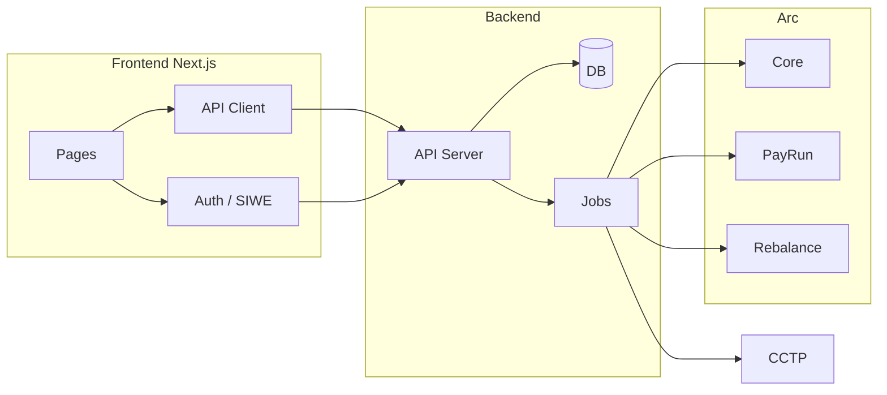

# Frontend–Backend Integration Plan

This plan applies **after** the frontend (Dayforce-style UI with mock data) and the backend + contracts are built. It describes how to connect them so the app works end-to-end.

**Prerequisites:** Frontend plan implemented (dashboard, pay runs, recipients, treasury, my-earnings, my-time, policies); backend plan implemented (API, DB, contracts deployed, Arc/CCTP wired).

---

## 1. Environment and config

- **Frontend:** Add `NEXT_PUBLIC_API_URL` (e.g. `https://api.example.com` or `http://localhost:3001`) to `.env.local`. Optionally `NEXT_PUBLIC_CHAIN_ID` for Arc testnet/mainnet so wallet and contract reads use the correct chain.
- **Backend:** CORS allows the frontend origin (e.g. `http://localhost:3000` in dev, production frontend URL in prod). Backend has RPC URL for Arc (and any CCTP chains), contract addresses (Core, PayRun, Rebalance), and signer keys for execute/rebalance.
- **Contracts:** Deployed on Arc testnet (or target chain); addresses and ABIs available to both frontend (read-only, optional) and backend (read + write).

---

## 2. Auth (wallet → backend session)

- **Flow:** User connects wallet in frontend (RainbowKit). Frontend triggers SIWE (or backend’s wallet sign-in): user signs a message; frontend sends signature to backend; backend verifies and creates session (JWT or cookie), returns **role** (admin vs employee) and optional profile.
- **Frontend:** Store session (cookie or token in memory/localStorage); attach to all API requests (e.g. `Authorization: Bearer <token>` or cookie). Use role to show admin vs employee nav (Dashboard, Pay Runs, Recipients, Treasury, Policies vs My earnings, My time).
- **Backend:** Protect routes by role; return 401/403 when unauthenticated or insufficient role. Map wallet address to employee record for “my” endpoints (earnings, time).

---

## 3. API client (frontend)

- **Replace mock with API:** Introduce an API client (e.g. `src/lib/api.ts` or `src/lib/trpc.ts`) that calls the backend. Use the same TypeScript types as the current mock (PayRun, Recipient/Employee, ChainBalance, etc.) so components stay unchanged; the client returns data in that shape (adapt backend response to frontend types if needed).
- **Endpoints to wire (align with backend plan 2.3):**

| Frontend need | Backend API | Notes |
|---------------|-------------|--------|
| Dashboard widgets | GET /dashboard or GET /treasury/balances + GET /pay-runs?status=pending + GET /pay-runs?status=executed&limit=1 | Total treasury, pending pay run, last pay run |
| Pay runs list | GET /pay-runs | id, period_start, period_end, status, total_amount, recipient_count, tx_hash if executed |
| Pay run detail | GET /pay-runs/:id | Items (recipient, amount, chain_id, status) |
| Create pay run (draft) | POST /pay-runs | period_start, period_end, items[] (employee_id, amount, chain_id) |
| Approve / Execute | POST /pay-runs/:id/approve, POST /pay-runs/:id/execute | Execute triggers on-chain createPayRun + ensure liquidity + executePayRun + sync |
| Recipients list | GET /recipients (or GET /employees) | wallet_address, name, pay_type, rate, chain_preference, schedule |
| Recipients CRUD | POST/PATCH/DELETE /recipients | Add/edit recipient (employee) |
| My earnings | GET /me/earnings | earned_to_date, already_paid, available_to_withdraw, pay_type, rate, breakdown |
| My time entries | GET /me/time-entries, POST /me/time-entries (check-in/out) | Or GET /me/schedule, GET /me/holidays for schedule-based |
| Schedule / holidays (admin) | GET/POST/PATCH /schedules, /holidays | Per employee or company |
| Treasury balances | GET /treasury/balances | USDC, USYC on Arc; optional per-chain |
| Manual rebalance / Auto policy | POST /treasury/rebalance, GET/POST /treasury/auto-policy | If backend exposes these |
| Policies | GET /policies, POST/PATCH /policies | List and create policy rules |

- **Errors:** Surface backend validation and contract errors in the UI (e.g. “Insufficient USDC; run rebalance” or “Pay run already executed”).

---

## 4. Contract reads and writes (frontend vs backend)

- **Backend owns:** Pay run execution (createPayRun, executePayRun), rebalance (usdcToUsyc, usycToUsdc), cross-chain (Bridge Kit). Frontend does **not** call these contracts directly for payroll; it calls backend APIs that perform the txs.
- **Frontend may still call contracts when:** (1) **CEO Company Capital** – optional: keep current flow where CEO wallet approves USDC and converts to USYC on Treasury page (frontend sends txs via wagmi) for simplicity; or move to “Trigger rebalance” button that calls backend POST /treasury/rebalance. (2) **Read-only:** frontend can read USDC/USYC balance of treasury from chain for real-time display, or rely on GET /treasury/balances from backend. Prefer backend for consistency; optional chain read for live balance.
- **Explorer links:** For executed pay runs, frontend uses `tx_hash` from API to build block explorer link (e.g. Arc testnet explorer).

---

## 5. Pay run flow (frontend + backend)

1. **Admin creates draft:** Frontend “New pay run” → select period, add recipients (from GET /recipients) and amounts (or use computed amounts from backend). POST /pay-runs with draft body → backend saves draft; returns pay_run with id.
2. **Admin views/edits:** GET /pay-runs/:id and show detail; allow edit until approved.
3. **Admin approves:** POST /pay-runs/:id/approve (backend sets status to approved).
4. **Admin executes:** POST /pay-runs/:id/execute. Backend: ensure liquidity (USYC→USDC if needed), createPayRun on-chain, executePayRun, handle cross-chain via Bridge Kit, sync DB, return tx_hash(es). Frontend shows success and link to explorer; refresh pay run list/detail.
5. **Employee “already paid out” and “available to withdraw”:** Backend derives from on-chain pay run history (or DB sync); GET /me/earnings returns updated values. No frontend contract calls.

---

## 6. Role and nav

- **Backend** returns role (admin vs employee) in auth response or GET /me.
- **Frontend** shows sidebar: admin sees Dashboard, Pay Runs, Recipients, Treasury, Policies; employee sees My earnings, My time (and optionally Dashboard with limited widgets). Unconnected users see connect prompt; connected users with no role see “Unauthorized” or limited view.

---

## 7. Data shape alignment

- **Pay run:** Backend returns id (UUID or int), period_start, period_end, status (draft | approved | executed | failed), total_amount, recipient_count or items[]. When executed: tx_hash (and optionally on_chain_pay_run_id). Frontend types already use PayRun with period, status, total amount, recipient count; map backend fields to these.
- **Recipient / Employee:** Backend returns wallet_address, name, pay_type, rate, chain_preference, schedule_id or embedded schedule. Frontend Recipient type: same fields so list and pay run builder work.
- **Earnings:** Backend returns earned_to_date, already_paid (total_paid), available_to_withdraw, pay_type, rate, optional breakdown (days/hours, period). Frontend MyEarningsPage consumes these.
- **Time entries / schedule:** Backend returns array of { date, clock_in, clock_out } or schedule + holidays; frontend MyTimePage and admin schedule/holiday UI consume these.

---

## 8. Testing and go-live

- **Manual/E2E:** Connect wallet as admin → create draft pay run → approve → execute → verify on-chain (explorer) and in GET /pay-runs. Connect as employee → check My earnings and My time. Trigger rebalance (if exposed) and confirm treasury balances update.
- **Deployment:** Deploy backend (API + jobs) and frontend; set NEXT_PUBLIC_API_URL to production API; ensure CORS and auth work in production. Document env vars for both repos.

---

## 9. Diagram (integration)

---

## 10. Summary

- **Frontend:** Add API base URL and chain config; implement API client that matches current mock types; replace mock data with API client; use auth response for role and nav; keep optional CEO manual USDC→USYC on Treasury or switch to backend trigger.
- **Backend:** Expose dashboard, pay runs (with id and tx_hash), recipients, my-earnings, my-time, treasury, policies; enforce auth and role; execute pay runs and rebalance on request.
- **Integration:** Auth (SIWE → session + role), API client (same types as mock), pay run flow (draft → approve → execute via API), explorer links from tx_hash, and role-based nav. After this, the app is a single end-to-end payroll product with Arc as hub and optional multi-chain payouts.
